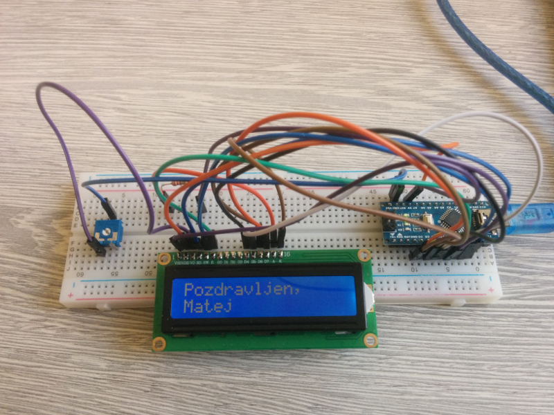

# Your LCD Name
Application for displaying a text on 16x2 LCD display (HD44780) with Arduino Nano. Demo for Codeweek workshops for children. Could be used for similar types of displays (for instance 20x4 LCD).

User enters his name through serial console and his name is then displayed on LCD screen.

